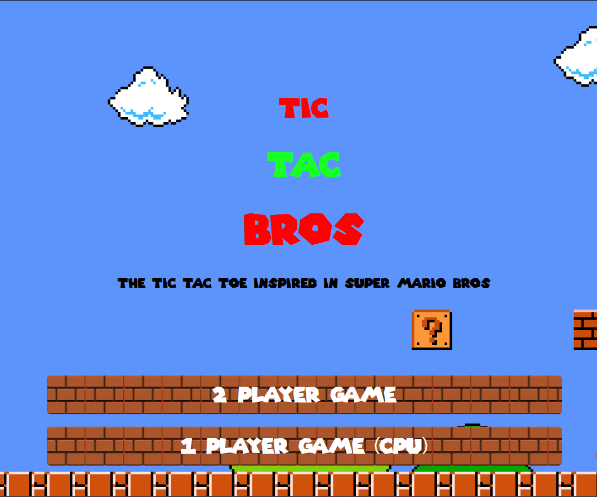

  

<h3 align="center">TIC TAC BROS</h3>

---

 a tic tac toe project but based in mario world.
      

## 📝 Table of Contents

- [About](#about)
- [Getting Started](#getting_started)
- [Deployment](#deployment)
- [Usage](#usage)

## 🧠About 

This is a game project for my bootcamp, that consist on a tic tac toe, personally wanted to inspire it in the Mario bros world.

## 🏁 Getting Started 

Only a browser is needed to play!
See [deployment](https://davidpalacin.github.io/proyectoSemana3/gameMenu.html)
